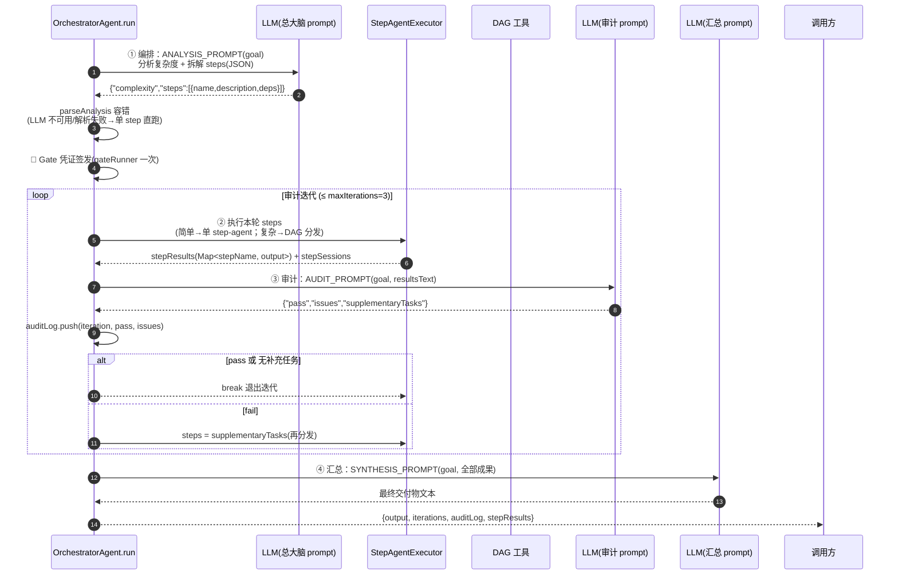
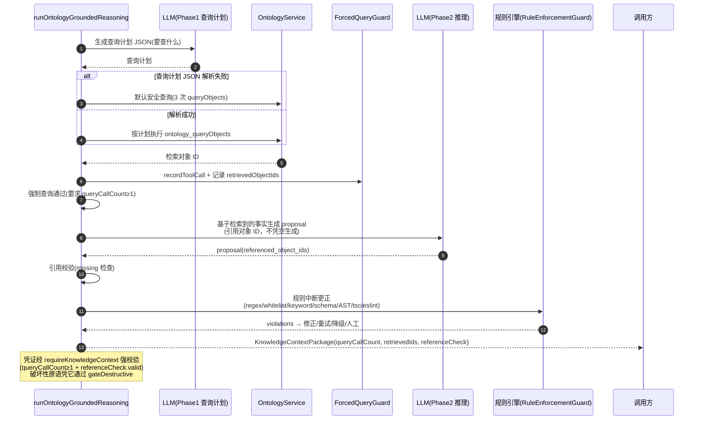

# MorPex Harness 工作原理 —— 用户输入 → 交付产物全链路

> 本文聚焦 **harness（执行/Agent 框架）内部如何工作**：每个环节的组件、循环机制、状态流转。
> 基于实测日志（199 任务）与源码（OrchestratorAgent / StepAgentExecutor / agent-spawner / PiBridge / runOntologyGroundedReasoning / ContextAssemblyEngine）。

---

## 一、全景：用户输入 → 交付产物（Harness 组件视角）

```mermaid
flowchart LR
    subgraph L1["① 入口与门禁"]
        A[用户输入 goal] --> B[CompanyFacade.executeGoal]
        B --> C[ControlPlane.checkAll<br/>授权/策略/资源校验]
    end

    subgraph L2["② Gate 强制检索知识"]
        C --> D[GroundedReasoning<br/>Phase1 强制查询]
        D --> E[Phase2 基于事实推理]
        E --> F[签发 KnowledgeContextPackage<br/>queryCallCount≥1 才放行]
    end

    subgraph L3["③ 统一规划 + 装配"]
        F --> G[HierarchicalPlanner<br/>Ontology grounded 规划]
        G --> H[ContextAssemblyEngine<br/>聚焦上下文 + 近期摘要 + 风险]
    end

    subgraph L4["④ 总大脑编排"]
        H --> I[OrchestratorAgent.run<br/>分析复杂度 + 拆解 steps]
        I --> J{复杂任务?}
        J -->|简单| K[单 step-agent]
        J -->|复杂| L[DAG 分发 N 个 step-agent]
    end

    subgraph L5["⑤ step-agent 执行（AgentHarness 循环）"]
        K --> M[StepAgentExecutor]
        L --> M
        M --> N[agentSpawner.spawn<br/>pi-agent-core AgentHarness]
        N --> O[LLM 思考 + 工具调用循环]
        O --> P[原语工具<br/>knowledge/file/shell/api/artifact]
    end

    subgraph L6["⑥ 审计 + 汇总"]
        P --> Q[LLM 审计 pass/fail]
        Q -->|fail| R[补充任务再分发<br/>≤3 轮]
        Q -->|pass| S[LLM 汇总交付物]
    end

    subgraph L7["⑦ 评价 + 抽离 + 交付"]
        S --> T[VerificationEngine.verify<br/>质量校验]
        T --> U[Evaluation 评分]
        U --> V[context.snapshot 抽离<br/>EventStore + ContextPersistence]
        V --> W[ArtifactFacade 交付物<br/>+ CEO 执行报告]
    end

    style D fill:#e8f0fe
    style N fill:#fff3cd
    style Q fill:#d4edda
```



---

## 二、总大脑（OrchestratorAgent）内部工作流

总大脑是**纯编排者**：不执行动手工作，只做"拆解 → 派发 → 审计 → 汇总"。



**关键机制**：
- **容错降级**：LLM 拆解返回非法 JSON → 回退单 step 直跑；LLM 不可用 → 跳过审计默认 pass
- **Gate 凭证一次签发**：覆盖整个编排，step-agent 的破坏性操作凭有效凭证解锁
- **审计迭代有界**：`maxIterations=3` 防无限补充循环；每次 fail 生成补充任务再分发

---

## 三、step-agent + 执行肢（AgentHarness 循环）—— 核心 harness 机制

这是"agent 怎么工作"的核心：pi-agent-core 的 AgentHarness 执行 **"LLM 思考 → 工具调用 → 结果回填 → 再思考"** 的循环。

```mermaid
flowchart TD
    A[StepAgentExecutor.executeStep] --> B[组装 systemPrompt<br/>职责+总目标+工作守则+沙箱目录]
    B --> C[创建沙箱<br/>data/agent-workspace/&lt;nodeId&gt;/]
    C --> D[agentSpawner.spawn<br/>PiBridge.createAgentHarness]
    D --> E[注入持久化 session<br/>JsonlSessionRepo]

    subgraph HARNESS["pi-agent-core AgentHarness 内部循环"]
        E --> F[agent.prompt(input)]
        F --> G{LLM 输出}
        G -->|仅文本| H[直接返回 content]
        G -->|工具调用<br/>tool_calls| I[agent-loop 解析<br/>type=toolCall 块]
        I --> J[executeToolCalls<br/>并行/串行]
        J --> K[AgentTool.execute<br/>(toolCallId, params)]
        K --> L[primitiveAgentTools 桥]
        L --> M{参数校验<br/>validateRequiredParams}
        M -->|✅| N[原语执行<br/>Gate/沙箱/白名单校验]
        N -->|成功| O[结果 isError:false<br/>回填 tool result]
        N -->|失败| P[结果 isError:true<br/>回填错误给 LLM]
        M -->|空参| Q{knowledge 空 query?}
        Q -->|有 goal| R[goal 兜底 ✅]
        Q -->|否| S[isError + 正确调用示例]
        O --> G
        P --> G
        S --> G
    end

    F --> T[extractText 提取文本]
    T -->|空| U[纠正性重试 1 次<br/>会话 9 防御]
    U -->|仍空| V[降级 fallback<br/>ExecutionFabric 单次 LLM]
    T -->|有文本| W[step 成果返回总大脑]

    style HARNESS fill:#fff3cd
    style R fill:#d4edda
    style V fill:#f8d7da
```

**循环机制详解**（pi-agent-core agent-loop）：
1. **LLM 单次输出**可能是纯文本 或 `tool_calls`（声明要调工具）
2. 若含 `tool_calls`：agent-loop 把每个工具调用转成 `{type:"toolCall", id, name, arguments}` 块
3. **并行/串行执行**工具（执行模式决定），结果回填 messages
4. 回填后**再次调用 LLM**（上下文含工具结果）→ 循环直到 LLM 输出纯文本（最终答案）
5. **参数流**：`LLM 的 arguments(JSON 字符串) → parseStreamingJson → AgentTool.execute(toolCallId, params) → 原语`
6. 每次循环的对话**自动落盘**到注入的 JsonlSessionRepo（进程重启不丢）

---

## 四、Gate 强制检索知识（两阶段推理）

"强制检索"是 MorPex 的核心安全设计：**任何生成/操作前必须先从本体检索到真实事实**，否则不发凭证。



**关键机制**：
- **默认安全查询**：LLM 查询计划 JSON 解析失败（思考模式常见）→ 回退 3 次 queryObjects，不阻断
- **凭证强校验**：`requireKnowledgeContext` 检查 queryCallCount≥1 + referenceCheck.valid，无效即抛错
- **规则中断**：提案生成后过 6 类检测器（确定性优先），违规 → 词法修正 → 结构修正(eslint/AST/tsc) → LLM 重试(≤3) → 降级/人工
- **凭证一次签发**：总大脑编排复用，不重复两阶段

---

## 五、聚焦上下文装配（L4 Harness）

```mermaid
flowchart TD
    A[ContextAssemblyEngine.assemble] --> B[选择模板]
    B --> C[收集 8 来源片段<br/>user_profile/goal_graph/mission_state/artifact_lineage/...]
    C --> D{聚焦模式?}
    D -->|是| E[三分法过滤<br/>系统级必装/任务级按 taskRef/历史级跳过]
    D -->|否| F[全量收集]
    E --> G[Provider 归属标记<br/>registered/fallback]
    G --> H[近期摘要召回<br/>EventStore+ContextPersistence 双源 ≤N 条]
    H --> I[风险分级<br/>goal 关键词 low/medium/high]
    I --> J[focusedSummary 拼接<br/>系统约束+近期摘要+片段摘要]
    J --> K[providerAttribution 汇总]
    K --> L[装配快照持久化<br/>ContextPersistence(惰性 provider)]
    L --> M[返回 ExecutionContext<br/>供 planner/executor 使用]

    style E fill:#e8f0fe
    style H fill:#d4edda
```

---

## 六、Harness 关键机制速查表

| 机制 | Harness 组件 | 实测行为 |
|---|---|---|
| Agent 执行循环 | pi-agent-core AgentHarness（agentSpawner 创建）| LLM 思考 ↔ 工具调用循环 |
| 工具桥 | primitiveAgentTools（5 原语→AgentTool）| execute 真正调原语，含参数校验 |
| Gate 凭证 | GroundedReasoning → requireKnowledgeContext | queryCallCount≥1 强校验，破坏性操作解锁 |
| 审计循环 | OrchestratorAgent 审计 Agent | pass/fail ≤3 轮，fail 补充任务再分发 |
| 沙箱隔离 | StepAgentExecutor workspaceDir | 产物落 data/agent-workspace/，零污染 |
| 会话持久化 | JsonlSessionRepo（PiBridge 注入）| 对话/工具调用 JSONL 落盘，跨重启 |
| 空参自愈 | validateRequiredParams + goal 兜底 | knowledge 空 query 用 step goal 兜底 |
| 判空防御 | extractText + 纠正性重试 | 空 content 重试 1 次再降级 |
| 令牌计费 | onTokenUsage → CostController | Gate/编排 LLM 调用 usage.total 精确计 |
| 持久化召回 | EventStore + ContextPersistence | loadMerged 双源合并按 taskRef |

---

## 七、真实日志证据（各环节）

```
用户输入 → [CompanyFacade] 🎯 executeGoal: <goal>
门禁     → ├─ ControlPlane: 通过 (goal=true, policy=true, resource=true)
强制检索 → [GroundedReasoning] 🏁 Phase 1 - 强制查询
           ├─ 已执行 ontology_queryObjects → 获取 10 条结果
           └─ ✅ 强制查询通过 (3 次调用, 20 个对象, tier=tier-1)
规划     → [MorPexRuntime] 📋 统一规划完成: N 步
装配     → [MorPexRuntime] 🧩 聚焦上下文已装配 (X 字符)
编排     → [OrchestratorAgent] 🎫 Gate 凭证签发成功（queryCallCount=3）
执行肢   → [StepAgentExecutor] / [ShellExecutionPrimitive] 💻 / [FileOperationPrimitive] 📁
评价     → 🔄 [CrossAgentLearningEngine] learnFromOutcome → [MorPexRuntime] ⚠️ Evaluation
进化     → [MorPexRuntime] 🔄 进化分析: N 个提案
交付     → [report] ✅ N 份报告已生成 → data/trace-reports
```
