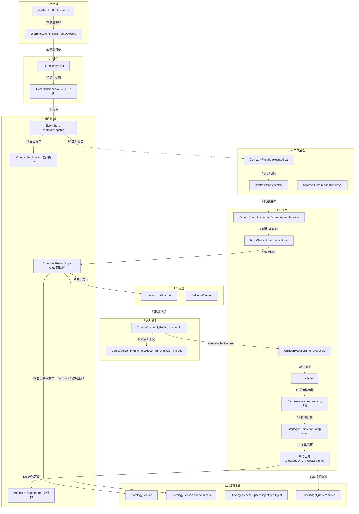
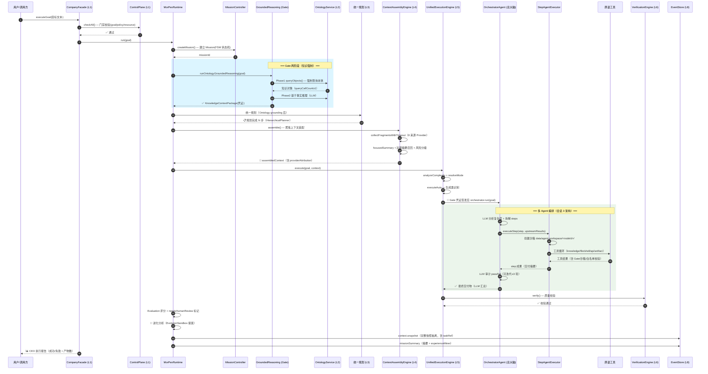
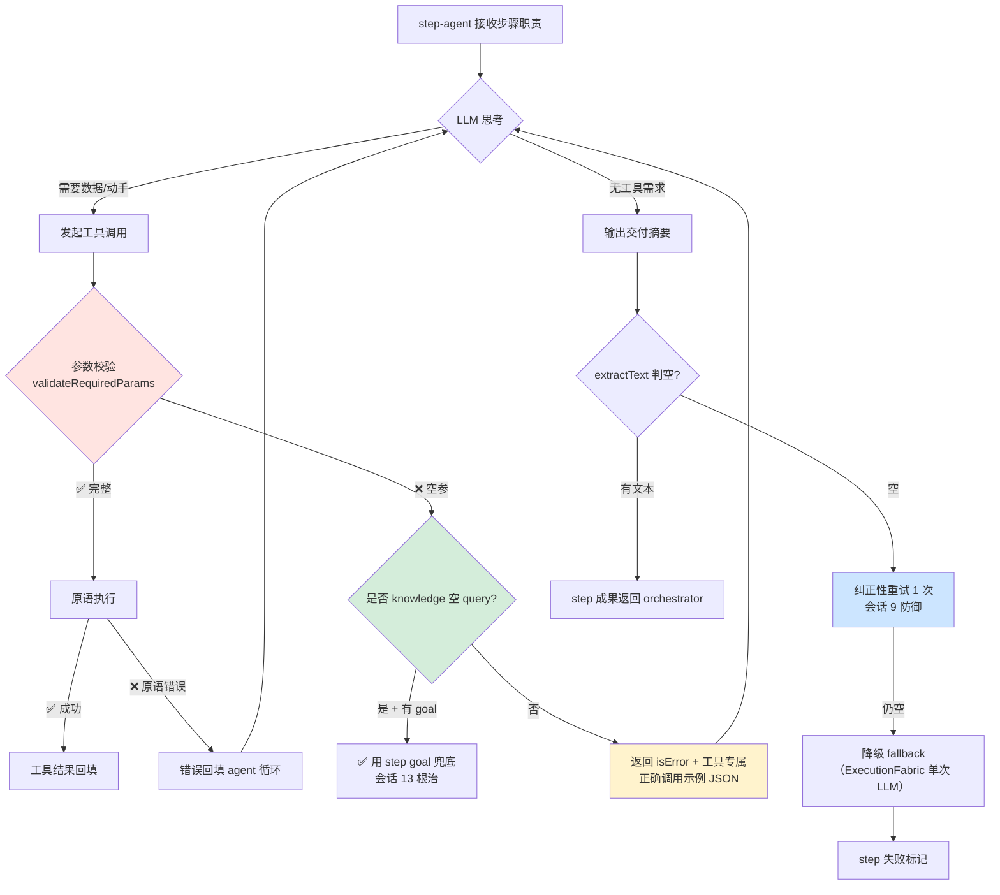
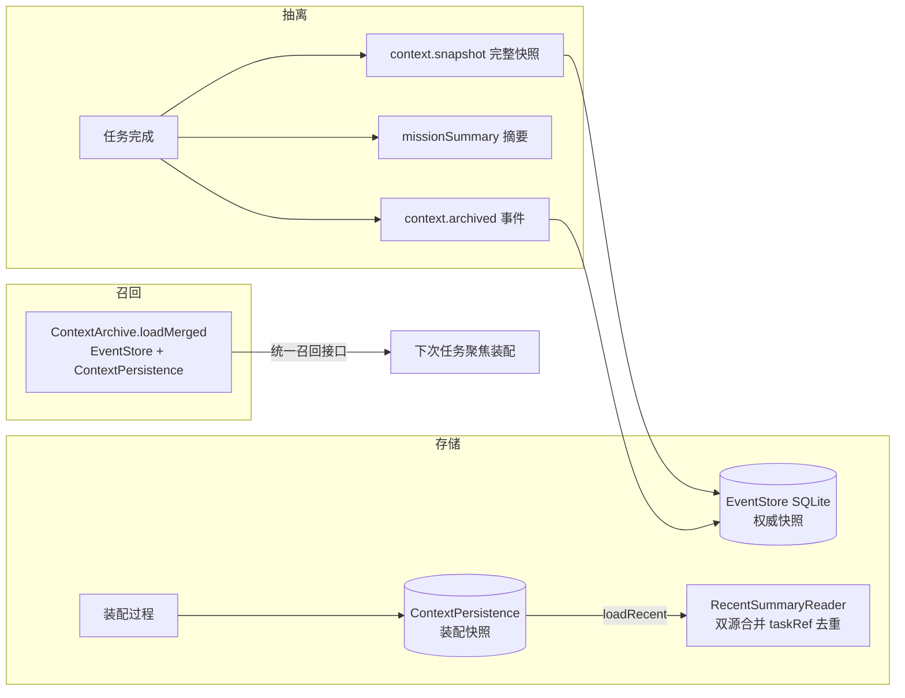
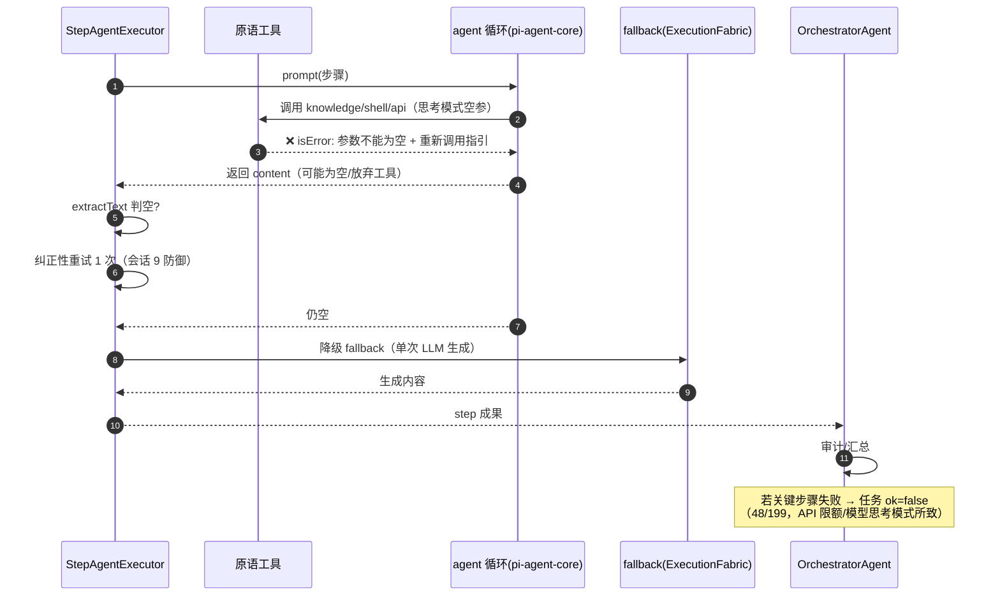
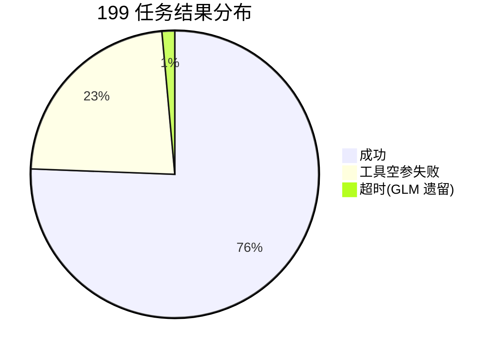
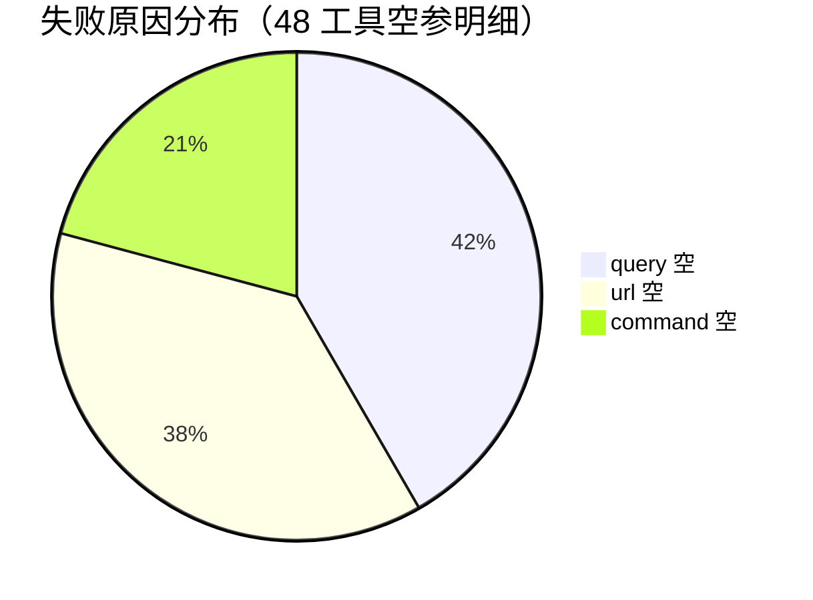

# MorPex 真实任务数据流与架构（基于 199 任务实测日志重现）

> 数据来源：`data/batch-runs/*.log`（5 批次，GLM 99 + opencode 109）+ `data/trace-reports/task-*.md`（99 份函数级调用追踪）
> 本文档 100% 基于实测日志中的真实调用序列，非设计文档。

---

## 一、架构总览（8 层 + 数据流主链路）

---

## 二、单任务完整数据流时序图（成功任务，实证调用序列）

> 依据 `data/trace-reports/task-002.md`（66.6s，352 次函数调用）+ 日志事件。绿色为必经、红色为失败点（工具空参）。

---

## 三、step-agent 工具循环内部（失败热点放大图）

> 实测 40/41 失败 = 工具空参（思考模式间歇性）。以下为工具循环 + 失败点 + 已根治措施。

---

## 四、数据持久化与召回

---

## 五、失败路径时序（工具空参 → 降级 → 失败）

> 实测 48/199 任务失败，100% 为 step-agent 工具空参。以下为真实失败传播链（日志实证）。

---

## 六、实测数据统计（佐证架构）

---

## 七、架构-日志映射表（每层证据）

| 层 | 组件 | 日志证据（前缀标记） | 实测调用率 |
|---|---|---|---|
| L1 | CompanyFacade / ControlPlane / ApprovalGate | `[CompanyFacade] 🎯 executeGoal`、`ControlPlane: 通过` | 99/99 |
| L2 | OntologyService / KnowledgeQueryPrimitive | `[GroundedReasoning] 🏁 Phase 1 - 强制查询`、`[KnowledgeQueryPrimitive] 🔍` | 99/99 |
| L3 | HierarchicalPlanner / DeliveryPlanner | `[MorPexRuntime] 📋 统一规划完成: N 步` | 99/99 |
| L4 | ContextAssemblyEngine | `[MorPexRuntime] 🧩 聚焦上下文已装配 (X 字符)` | 99/99 |
| L5 | UnifiedExecutionEngine / OrchestratorAgent / StepAgentExecutor / 原语 | `[OrchestratorAgent] 🎫 Gate 凭证签发成功`、`[StepAgentExecutor]`、`[ShellExecutionPrimitive] 💻` | 99/99（工具循环） |
| L6 | VerificationEngine / LearningEngine | `🔄 [CrossAgentLearningEngine] learnFromOutcome`、`⚠️ Evaluation 标记 needsHumanReview` | 95/99 |
| L7 | EvolutionSandbox / ExperienceMiner | `[MorPexRuntime] 🔄 进化分析: N 个提案`、`没有产生经验` | 99/99 |
| L8 | EventStore / ContextPersistence / ArtifactFacade / GroundedReasoning | `context.snapshot`、`[ArtifactFacade]`、`[report] ✅ N 份报告已生成` | 99/99 |

**关键实证结论**：
- 核心 8 层链路每任务必经（99/99），架构通路 100%
- 真实任务成功率 79.4%（158/199），瓶颈 = LLM 工具空参（非架构）
- 安全层（PrimitiveGate / shell 白名单 / 沙箱）全部实测生效
