# MorPex v4.0 — 后端架构全链路文档

> 基于实际代码的完整架构图、数据流和依赖关系。
> 最后更新: 2026-07-18

---

## 目录

1. [分层架构总览](#1-分层架构总览)
2. [Mermaid 依赖图](#2-mermaid-依赖图)
3. [启动流程](#3-启动流程)
4. [请求执行全链路](#4-请求执行全链路)
5. [事件流](#5-事件流)
6. [Meta-Plane 闭环](#6-meta-plane-闭环)
7. [Agent 创建链路](#7-agent-创建链路)
8. [依赖分层规则](#8-依赖分层规则)
9. [Pi 升级影响范围](#9-pi-升级影响范围)
10. [控制权归属](#10-控制权归属)

---

## 1. 分层架构总览

```
┌──────────────────────────────────────────────────────────────────┐
│ L5  Gateway Layer (Studio)                                       │
│     StudioServer · SessionManager · REST/SSE                    │
│     ★ 唯一实例化 MetaPlanner 的位置                               │
│     ⚠️ 仍有直接 Pi import（待迁移）                               │
└──────────────────────────┬───────────────────────────────────────┘
                           │ HTTP/SSE + 直接调用
┌──────────────────────────┴───────────────────────────────────────┐
│ L4  Meta-Plane                                                    │
│     MetaPlanner · PlanningIntelligenceEngine · PipelineExecutor │
│     PlanAnalyzer · SessionErrorExtractor · ToolQualityManager   │
│     DeviationGuard · RuntimeController · CheckpointManager      │
│     ★ 零 Pi 依赖 · 通过 EventBus + 接口驱动下层                    │
└──────────────────────────┬───────────────────────────────────────┘
                           │ 订阅 EventBus + 包裹 orchestrateFn
┌──────────────────────────┴───────────────────────────────────────┐
│ L3  Business Plane                                                │
│                                                                   │
│  ┌─ Agent Plane ──────────────────────────────────────────────┐  │
│  │ AgentOrchestrator · SwarmEngine                            │  │
│  │ → adapters/identity (generateShortUUID)                     │  │
│  │ → adapters/pi-types (AgentTool)                             │  │
│  └────────────────────────────────────────────────────────────┘  │
│                                                                   │
│  ┌─ Control Plane ────────────────────────────────────────────┐  │
│  │ ExecutionOrchestrator · IntentResolver                      │  │
│  │ → CrossDomainRouter · DomainDispatcher                      │  │
│  │ → adapters/pi-utils (mpParseJsonWithRepair)                 │  │
│  └────────────────────────────────────────────────────────────┘  │
│                                                                   │
│  ┌─ Runtime Kernel ───────────────────────────────────────────┐  │
│  │ FSMEngine · DAGEngine · ExecutionGraph · SchedulerEngine   │  │
│  │ ★ 零外部依赖（纯算法 + 内部类型）                              │  │
│  └────────────────────────────────────────────────────────────┘  │
│                                                                   │
│  ┌─ Knowledge Plane ──────────────────────────────────────────┐  │
│  │ ArtifactRegistry · KnowledgeGraph · VectorStore            │  │
│  │ → MemoryWiki (memory 包)                                    │  │
│  │ ★ 零 Pi 依赖                                                │  │
│  └────────────────────────────────────────────────────────────┘  │
│                                                                   │
│  ┌─ Domains ──────────────────────────────────────────────────┐  │
│  │ DomainCluster · DomainClusterManager                        │  │
│  │ → adapters/pi-types · adapters/domain-cluster               │  │
│  └────────────────────────────────────────────────────────────┘  │
│                                                                   │
│  ┌─ Services ─────────────────────────────────────────────────┐  │
│  │ AgentFactory · AgentService · LLMProvider                  │  │
│  │ → adapters/agent-spawner · adapters/model-registry         │  │
│  └────────────────────────────────────────────────────────────┘  │
│                                                                   │
│  ┌─ Tools ────────────────────────────────────────────────────┐  │
│  │ 9 tool files (AgentCreate, ForkExecute, ReadArtifact, ...)  │  │
│  │ → adapters/pi-types · adapters/pi-ai-types                  │  │
│  └────────────────────────────────────────────────────────────┘  │
│                                                                   │
│  ┌─ Memory ───────────────────────────────────────────────────┐  │
│  │ MemoryHooks · MemoryMessages · MemoryBusListener             │  │
│  │ → adapters/pi-types · adapters/pi-augmentations             │  │
│  └────────────────────────────────────────────────────────────┘  │
│                                                                   │
│  ┌─ Cross-Domain ─────────────────────────────────────────────┐  │
│  │ CrossDomainRouter · DomainDispatcher · ArbitrationHandler   │  │
│  │ → LLMProvider · DomainClusterManager                        │  │
│  │ ★ 零 Pi 依赖                                                │  │
│  └────────────────────────────────────────────────────────────┘  │
│                                                                   │
│  ┌─ Other ────────────────────────────────────────────────────┐  │
│  │ PermissionEngine · NegotiationEngine · CompactionPolicy     │  │
│  │ IndustryRegistry · SessionProjection · MCP                  │  │
│  │ ★ 全部零 Pi 依赖                                            │  │
│  └────────────────────────────────────────────────────────────┘  │
└──────────────────────────┬───────────────────────────────────────┘
                           │
┌──────────────────────────┴───────────────────────────────────────┐
│ L2  Infrastructure                                                │
│     Kernel · EventBus · ExecutionIdentity · PluginSystem        │
│     ExecutionGateway · ContractGateway · PiAdapterBridge         │
│     ExecutionMirror · JSONLStorage · EventStore                  │
│     ★ 零 Pi import（PiAdapterBridge 通过 PiAdapter 间接接触）      │
└──────────────────────────┬───────────────────────────────────────┘
                           │
┌──────────────────────────┴───────────────────────────────────────┐
│ L1  Adapter Layer ★ 唯一 Pi import 入口                          │
│                                                                   │
│  core/src/adapters/ (9 files)                                    │
│  ├─ pi-types.ts          → import type { AgentTool, ... }        │
│  ├─ pi-ai-types.ts       → import { Type }                       │
│  ├─ pi-utils.ts          → import { uuidv7, getModel, ... }      │
│  ├─ pi-augmentations.ts  → declare module '...'                  │
│  ├─ agent-spawner.ts     → import { AgentHarness, ... }          │
│  ├─ domain-cluster.ts    → import { AgentHarness, ... }          │
│  ├─ model-registry.ts    → import { getModels, ... }             │
│  ├─ thinking-level.ts    → import { clampThinkingLevel, ... }    │
│  ├─ model-resolver.ts    → import { getModel, getProviders }     │
│  └─ identity.ts          → crypto.randomUUID() (零 Pi)           │
│                                                                   │
│  packages/adapters/ (3 adapters)                                 │
│  ├─ pi-ai/PiAIAdapter.ts          → InferencePort 实现            │
│  ├─ pi-agent-core/PiAgentCoreAdapter.ts → AgentRuntimePort 实现   │
│  └─ mock-runtime/MockRuntimeAdapter.ts  → 双端口 Mock（零 Pi）     │
└──────────────────────────┬───────────────────────────────────────┘
                           │
┌──────────────────────────┴───────────────────────────────────────┐
│ L0  Contracts · Stable Ports                                      │
│     InferencePort · AgentRuntimePort · ToolDefinition            │
│     AgentRuntimeEvent · InferenceEvent · RuntimeError            │
│     ★ 零依赖，纯 TypeScript 类型                                   │
└──────────────────────────────────────────────────────────────────┘
                           │
┌──────────────────────────┴───────────────────────────────────────┐
│ Pi  Packages                                                      │
│     @earendil-works/pi-ai@0.79.10                                │
│     @earendil-works/pi-agent-core@0.79.10                        │
└──────────────────────────────────────────────────────────────────┘
```

---

## 2. Mermaid 依赖图

```mermaid
graph TD
    subgraph Studio["L5: Gateway (Studio)"]
        SS["StudioServer"]
        SM["SessionManager"]
    end

    subgraph Meta["L4: Meta-Plane"]
        MP["MetaPlanner"]
        PIE["PlanningIntelligenceEngine"]
        PE["PipelineExecutor"]
        PA["PlanAnalyzer"]
        RC["RuntimeController"]
    end

    subgraph Business["L3: Business Plane"]
        subgraph AP["Agent Plane"]
            AO["AgentOrchestrator"]
        end
        subgraph CP["Control Plane"]
            EO["ExecutionOrchestrator"]
            IR["IntentResolver"]
        end
        subgraph RK["Runtime Kernel"]
            FSM["FSMEngine"]
            DAG["DAGEngine"]
        end
        subgraph KP["Knowledge Plane"]
            AR["ArtifactRegistry"]
            KG["KnowledgeGraph"]
        end
        DC["DomainCluster"]
        DCM["DomainClusterManager"]
        AF["AgentFactory"]
        AS["AgentService"]
        Tools["9 Tool Files"]
        MH["MemoryHooks"]
        MM["MemoryMessages"]
        CDR["CrossDomainRouter"]
        DD["DomainDispatcher"]
    end

    subgraph Infra["L2: Infrastructure"]
        K["Kernel"]
        EB["EventBus"]
        EI["ExecutionIdentity"]
        EG["ExecutionGateway"]
        CG["ContractGateway"]
        PAB["PiAdapterBridge"]
        EM["ExecutionMirror"]
        ES["EventStore"]
    end

    subgraph Adapters["L1: Adapter Layer"]
        PT["pi-types.ts"]
        PAT["pi-ai-types.ts"]
        PU["pi-utils.ts"]
        ASp["agent-spawner.ts"]
        DC2["domain-cluster.ts"]
        MR["model-registry.ts"]
        TL["thinking-level.ts"]
        MRes["model-resolver.ts"]
        ID2["identity.ts"]
        PiAI["PiAIAdapter"]
        PiAC["PiAgentCoreAdapter"]
        Mock["MockRuntimeAdapter"]
    end

    subgraph Contracts["L0: Contracts"]
        IP["InferencePort"]
        ARP["AgentRuntimePort"]
        TD["ToolDefinition"]
        RE["RuntimeError"]
    end

    subgraph Pi["Pi Packages"]
        pi_ai["pi-ai"]
        pi_ac["pi-agent-core"]
    end

    %% Dependencies
    SS --> K
    SS --> MP
    SM --> pi_ac
    SM --> pi_ai

    MP --> EB
    MP --> EO

    AO --> ID2
    AO --> PT
    DC --> PT
    DC --> DC2
    DCM --> PT
    DCM --> DC2
    AF --> ASp
    AS --> ASp
    AS --> MR
    Tools --> PT
    Tools --> PAT
    MH --> PT
    MM --> PT
    IR --> PU

    K --> EB
    K --> EI
    K --> EG
    K --> CG
    K --> PAB
    K --> EM
    K --> ES
    EG --> PiAdapter["PiAdapter (old)"]
    PAB --> PiAdapter
    CG --> Contracts

    PT --> pi_ac
    PAT --> pi_ai
    PU --> pi_ac
    PU --> pi_ai
    ASp --> pi_ac
    ASp --> pi_ai
    DC2 --> pi_ac
    DC2 --> pi_ai
    MR --> pi_ai
    TL --> pi_ai
    MRes --> pi_ai
    PiAI --> pi_ai
    PiAC --> pi_ac
    PiAI --> Contracts
    PiAC --> Contracts
    Mock --> Contracts

    style Contracts fill:#e1f5e1
    style Adapters fill:#fff3cd
    style Pi fill:#f8d7da
    style Meta fill:#d1ecf1
```



---

## 3. 启动流程

```
bootstrapMorPexCore(runtime)                       ← packages/core/bootstrap.ts
│
├─ ① setAgentFactory(new AgentFactory())           ← 全局单例
│     └─ AgentFactory.spawn() → agentSpawner.spawn() → pi-agent-core
│
├─ ② new MorPexKernel(config)                      ← 构造（不启动）
│     │
│     ├─ new EventBus()                            ← 内存 pub/sub，AsyncLocalStorage 隔离
│     │
│     ├─ new ExecutionIdentity()                   ← ID 生成器
│     │     └─ → adapters/identity.ts → crypto.randomUUID()
│     │
│     ├─ new PluginSystem(eventBus, identity)       ← 插件容器（toposort 依赖排序）
│     │
│     ├─ new JSONLStorage(path)                    ← 文件存储层
│     │
│     ├─ new ExecutionMirror(storage)               ← 执行轨迹录制器
│     │
│     ├─ new ExecutionGateway(eventBus, identity)   ← 旧网关（AgentRuntimeAdapter 路由）
│     │
│     ├─ new ContractGateway()                     ← ★ 新网关（AgentRuntimePort 路由）
│     │
│     ├─ new EventStore()                           ← 事件溯源存储
│     │
│     └─ new EngineSubscriber({eventBus, eventStore}) ← 引擎事件→溯源桥接
│
├─ ③ kernel.registerPiRuntime(runtime)             ← 注册外部 Pi 运行时
│     │
│     ├─ new PiAdapter(runtime, eventBus, ...)     ← 包装 runtime（使用 any 类型避免编译依赖）
│     │
│     ├─ ExecutionGateway.registerAdapter('pi', piAdapter)
│     │
│     ├─ new PiAdapterBridge(piAdapter)            ← 旧→新桥接
│     │
│     └─ ContractGateway.register('pi-bridge', bridge)
│
└─ ④ kernel.start()                                ← 启动内核
      │
      ├─ storage.initialize()                       ← 创建目录
      ├─ mirror.start(fn)                          ← 订阅 EventBus
      ├─ pluginSystem.startAll()                   ← FSM/DAG/Knowledge/Orch/Intent/Memory...
      │     └─ 每个 Plugin.initialize(context) → Plugin.start()
      │
      └─ phase = 'running'
            └─ emit → EventBus { type: 'kernel.started' }
```

---

## 4. 请求执行全链路

```
用户请求（HTTP POST /api/execute）
│
▼
┌─────────────────────────────────────────────────────────────────┐
│ StudioServer                                                    │
│   ├─ 解析请求 → SessionContext                                   │
│   ├─ StudioOrchestrator.route(sessionId, input)                 │
│   └─ initMetaPlanner() → new MetaPlanner({...})                 │
│         └─ metaPlanner.wrapOrchestrate(orchestrateFn)           │
└────────────────────────┬────────────────────────────────────────┘
                         │
                         ▼
┌─────────────────────────────────────────────────────────────────┐
│ ExecutionOrchestrator.orchestrate(sessionContext)               │
│   │                                                             │
│   ├─ ① CrossDomainRouter.decompose(userIntent)                  │
│   │     ├─ LLMProvider.call(prompt) → pi-ai                     │
│   │     └─ extractJson(response) → DAGNode[]                    │
│   │                                                             │
│   ├─ ② DomainDispatcher.dispatch(dag)                           │
│   │     ├─ DAGNode → 匹配 DomainCluster                         │
│   │     ├─ 资源锁 AsyncResourceLocker                           │
│   │     └─ DomainCluster.execute(task)                          │
│   │                                                             │
│   └─ ③ DomainCluster.execute(task)                              │
│         ├─ buildTools() → AgentTool[]                           │
│         │     → adapters/pi-types.ts                            │
│         │                                                       │
│         ├─ spawnSubAgent(params)                                │
│         │     → AgentFactory.spawn(ctx)                         │
│         │       → agentSpawner.spawn()                          │
│         │         → new AgentHarness({env, model, session, ...})│
│         │                                                       │
│         └─ harness.prompt(input)                                │
│               │                                                 │
│               ▼                                                 │
│         ┌──────────────────────────────────┐                    │
│         │ pi-agent-core Agent Loop         │                    │
│         │  ├─ LLM 调用 → pi-ai streamSimple│                    │
│         │  ├─ Tool Call → 执行 → Result    │                    │
│         │  ├─ compaction (上下文压缩)       │                    │
│         │  └─ harness.subscribe(listener)  │                    │
│         └──────────────┬───────────────────┘                    │
│                        │                                        │
│                        ▼                                        │
│         ┌──────────────────────────────────┐                    │
│         │ EventBus.emit(MorPexEvent)       │                    │
│         │  ├─ ExecutionMirror → JSONL      │                    │
│         │  ├─ EventStore → 事件溯源         │                    │
│         │  ├─ EngineSubscriber → MemoryBus │                    │
│         │  └─ StudioServer SSE → 前端       │                    │
│         └──────────────────────────────────┘                    │
└─────────────────────────────────────────────────────────────────┘
```

---

## 5. 事件流

```
                    ┌──────────────────┐
                    │  pi runtime.bus  │
                    │  tool.started    │
                    │  agent.start     │
                    │  agent.end       │
                    │  tool.completed  │
                    │  tool.failed     │
                    └────────┬─────────┘
                             │
                             ▼
                    ┌──────────────────┐
                    │   PiAdapter      │  ← gateway/adapters/PiAdapter.ts
                    │   bridgeRuntime  │
                    │   Events()       │
                    │   mapPiEvent()   │
                    └────────┬─────────┘
                             │
                             ▼
              ┌──────────────────────────────┐
              │         EventBus             │
              │  (内存 pub/sub + ALS 隔离)    │
              │                              │
              │  emit(MorPexEvent)            │
              │    id: evt_YYYYMMDD_xxxxxxxx │
              │    type: runtime.tool.called │
              │    executionId: exe_xxx      │
              │    source: pi               │
              │    payload: { ... }          │
              └──────┬──────────┬────────────┘
                     │          │
       ┌─────────────┤          ├─────────────┐
       ▼             ▼          ▼             ▼
┌──────────┐  ┌──────────┐  ┌──────────┐  ┌──────────────┐
│Execution │  │EventStore│  │ Engine   │  │PluginSystem  │
│Mirror    │  │          │  │Subscriber│  │(plugins)     │
│          │  │ 事件溯源  │  │          │  │              │
│→JSONL    │  │ 重放引擎  │  │→MemoryBus│  │→自定义处理    │
└──────────┘  └──────────┘  └──────────┘  └──────┬───────┘
                                                  │
                                                  ▼
                                         ┌──────────────┐
                                         │StudioServer  │
                                         │SSE 推送到前端 │
                                         └──────────────┘
```

---

## 6. Meta-Plane 闭环

```
                    ┌─────────────────────────────────────────────┐
                    │              META-PLANE (L4)                 │
                    │                                             │
                    │  StudioServer.initMetaPlanner()             │
                    │    └─ new MetaPlanner({...})                │
                    │         │                                   │
                    │         ├─ PlanExperienceStore (JSONL)      │
                    │         ├─ PlanAnalyzer (偏差分析)           │
                    │         ├─ ToolQualityManager (工具品控)     │
                    │         ├─ TemplateManager (模板进化)        │
                    │         ├─ DeviationGuard (偏离告警)         │
                    │         ├─ RuntimeController (重规划)        │
                    │         ├─ SessionErrorExtractor (根因提取)  │
                    │         │                                   │
                    │         ├─ PlanningIntelligenceEngine       │
                    │         │    ├─ analyze(record) → 差距分析   │
                    │         │    ├─ learn(gaps)    → 改进动作   │
                    │         │    └─ adapt(actions) → 更新配置   │
                    │         │                                   │
                    │         └─ wrapOrchestrate(orchestrateFn)   │
                    │               │                             │
                    │               ▼                             │
                    │         ┌──────────────────────────┐        │
                    │         │ 7-Stage Pipeline          │        │
                    │         │ S1 预验证                 │        │
                    │         │ S2 战略解构 (Strategic)    │        │
                    │         │ S3 拓扑探索 (Topology)     │        │
                    │         │ S4 前瞻模拟 (LookAhead)   │        │
                    │         │ S5 动态反射 (DynamicReflex)│        │
                    │         │ S6 计划生成               │        │
                    │         │ S7 后验证                 │        │
                    │         └──────────────────────────┘        │
                    │                                             │
                    │  依赖：Node built-ins + MemoryWiki          │
                    │  零 Pi 依赖。通过 EventBus 消费下层事件。     │
                    └─────────────────────────────────────────────┘
                                      │
                    ┌─────────────────┴─────────────────┐
                    │ 订阅 EventBus 事件:                │
                    │  · dag.node.started               │
                    │  · dag.node.completed             │
                    │  · dag.node.failed                │
                    │  · runtime.agent.started          │
                    │  · runtime.agent.completed        │
                    │  · runtime.agent.failed           │
                    └───────────────────────────────────┘
```

---

## 7. Agent 创建链路

```
DomainCluster.execute(task)
  │
  └─ spawnSubAgent(params)
       │
       └─ AgentFactory.spawn(ctx)                    ← services/AgentFactory.ts
            │
            ├─ 安全校验:
            │   ├─ identityToken 必填 → SecurityBoundaryException
            │   └─ cgroupQuota 未耗尽
            │
            └─ agentSpawner.spawn(params)            ← adapters/agent-spawner.ts ★
                 │
                 ├─ resolveModel(provider, modelId)  ← adapters/model-resolver.ts
                 │     └─ getModel(provider, modelId) ← @earendil-works/pi-ai
                 │
                 ├─ new NodeExecutionEnv({cwd})       ← @earendil-works/pi-agent-core/node
                 │
                 ├─ new InMemorySessionRepo()         ← @earendil-works/pi-agent-core
                 ├─ repo.create({id}) → session
                 │
                 └─ new AgentHarness({                ← @earendil-works/pi-agent-core
                      env,
                      model,
                      session,
                      tools,        ← AgentTool[] (→ adapters/pi-types.ts)
                      systemPrompt  ← compileExpertPrompt()
                    })
```

---

## 8. 依赖分层规则

```
                    ┌──────────────────────────────┐
                    │  L4 Meta-Plane               │
                    │  依赖: Node built-ins        │
                    │  + MemoryWiki (memory 包)     │
                    │  + internal types            │
                    │  禁: @earendil-works/*       │
                    └──────────────┬───────────────┘
                                   │
                    ┌──────────────┴───────────────┐
                    │  L3 Business Plane            │
                    │  依赖: adapters/ (类型重导出)  │
                    │  + contracts (类型)           │
                    │  + internal utils            │
                    │  禁: @earendil-works/*       │
                    └──────────────┬───────────────┘
                                   │
                    ┌──────────────┴───────────────┐
                    │  L2 Infrastructure            │
                    │  依赖: contracts (类型)       │
                    │  + adapters/PiAdapter (any)  │
                    │  + Node built-ins            │
                    │  禁: @earendil-works/*       │
                    └──────────────┬───────────────┘
                                   │
                    ┌──────────────┴───────────────┐
                    │  L1 Adapter Layer ★          │
                    │  依赖: contracts             │
                    │  + @earendil-works/*  ← 唯一  │
                    │  禁: core/ (业务模块)         │
                    └──────────────┬───────────────┘
                                   │
                    ┌──────────────┴───────────────┐
                    │  L0 Contracts                 │
                    │  依赖: 无                     │
                    │  禁: 任何包                   │
                    └──────────────────────────────┘
```

**ESLint 规则**:
```js
// Core (排除 adapters/) 禁止:
'@earendil-works/*'     → error
'packages/core/*'        → error (from contracts)

// Contracts 禁止:
'@earendil-works/*'     → error
'packages/core/*'        → error
'packages/adapters/*'    → error

// Adapters 允许:
'@earendil-works/*'     → ok
'@morpex/contracts'     → ok
'packages/core/*'        → error
```

---

## 9. Pi 升级影响范围

```
pi-ai 版本变更:
  ├─ packages/adapters/pi-ai/PiAIAdapter.ts              ▸ 1
  ├─ packages/adapters/pi-ai/pi-ai-request-mapper.ts     ▸ 1
  ├─ packages/adapters/pi-ai/pi-ai-event-mapper.ts       ▸ 1
  ├─ packages/adapters/pi-ai/pi-ai-error-mapper.ts       ▸ 1
  ├─ packages/adapters/pi-ai/model-resolver.ts           ▸ 1
  ├─ packages/core/src/adapters/pi-ai-types.ts           ▸ 1
  ├─ packages/core/src/adapters/model-registry.ts        ▸ 1
  ├─ packages/core/src/adapters/thinking-level.ts        ▸ 1
  ├─ packages/core/src/adapters/model-resolver.ts        ▸ 1
  └─ packages/core/src/adapters/pi-utils.ts              ▸ 1
  ───────────────────────────────────────────────────────────
  合计: 10 files（全部在 adapters 层）

pi-agent-core 版本变更:
  ├─ packages/adapters/pi-agent-core/PiAgentCoreAdapter.ts       ▸ 1
  ├─ packages/adapters/pi-agent-core/pi-agent-request-mapper.ts  ▸ 1
  ├─ packages/adapters/pi-agent-core/pi-agent-event-mapper.ts    ▸ 1
  ├─ packages/adapters/pi-agent-core/pi-agent-error-mapper.ts    ▸ 1
  ├─ packages/adapters/pi-agent-core/model-resolver.ts           ▸ 1
  ├─ packages/core/src/adapters/pi-types.ts              ▸ 1
  ├─ packages/core/src/adapters/pi-utils.ts              ▸ 1
  ├─ packages/core/src/adapters/pi-augmentations.ts      ▸ 1
  ├─ packages/core/src/adapters/agent-spawner.ts         ▸ 1
  └─ packages/core/src/adapters/domain-cluster.ts        ▸ 1
  ───────────────────────────────────────────────────────────
  合计: 10 files（全部在 adapters 层）

Core 业务模块 (L2-L4):     0 files 受影响
Meta-Plane (L4):           0 files 受影响
Contracts (L0):            0 files 受影响
```

---

## 10. 控制权归属

| 能力 | 所有者 | 实现位置 |
|------|:------:|------|
| 全局 run ID 生成 | MorPexCore | `ExecutionIdentity.createExecutionId()` |
| DAG 节点生命周期 | MorPexCore | `DAGEngine` + `ExecutionOrchestrator` |
| 任务状态机 | MorPexCore | `FSMEngine` |
| 优先级调度 | MorPexCore | `SchedulerEngine` |
| Agent 选择与编排 | MorPexCore | `AgentOrchestrator` + `DomainClusterManager` |
| 跨领域路由与仲裁 | MorPexCore | `CrossDomainRouter` + `ArbitrationHandler` |
| 顶层超时 | MorPexCore | `ExecutionGateway` + `ContractGateway` |
| 取消信号传播 | MorPexCore → Pi | `Kernel.registerPiRuntime()` → `AbortSignal` |
| 系统级重试 | MorPexCore | `MetaPlanner.replanPipeline()` |
| Checkpoint 元数据 | MorPexCore | `CheckpointManager` |
| Artifact 提交 | MorPexCore | `ArtifactRegistry` |
| MemoryBus 写入 | MorPexCore | `MemoryBusListener` + `MemoryHooks` |
| 审计与领域事件 | MorPexCore | `ExecutionMirror` + `EventStore` |
| 计划编排与自学习 | MorPexCore | `MetaPlanner` + `PlanningIntelligenceEngine` |
| LLM 推理执行 | Pi 后端 | `pi-ai streamSimple()` |
| Agent Loop 内部控制 | Pi 后端 | `pi-agent-core AgentHarness` |
| 工具执行 | Pi 后端 | `pi-agent-core tool execution` |
| 上下文压缩 | Pi 后端 | `pi-agent-core compaction` |
| Session 持久化 | Pi 后端 | `InMemorySessionRepo` |

**无双重控制**: MorPexCore 管理外层生命周期（DAG、调度、重试），Pi 管理内层执行（单次 Agent loop）。重试不在两层同时进行。Session ID 以 MorPex 的 `executionId` 为主键，Pi 的 `sessionId` 仅用于 provider 缓存优化。

---

## 附录：文件统计

| 层级 | 文件数 | Pi import | 说明 |
|------|:--:|:--:|------|
| L5 Gateway (Studio) | 2 | ⚠️ 2 | SessionManager, StudioServer |
| L4 Meta-Plane | ~25 | 0 | 全部零 Pi |
| L3 Business Plane | ~65 | 0 | 全部经 adapters/ |
| L2 Infrastructure | ~15 | 0 | 全部零 Pi |
| L1 Adapter Layer | 18 | ✅ 18 | 唯一 Pi import 入口 |
| L0 Contracts | 7 | 0 | 纯类型，零依赖 |
| **总计** | **~132** | **20** | |
