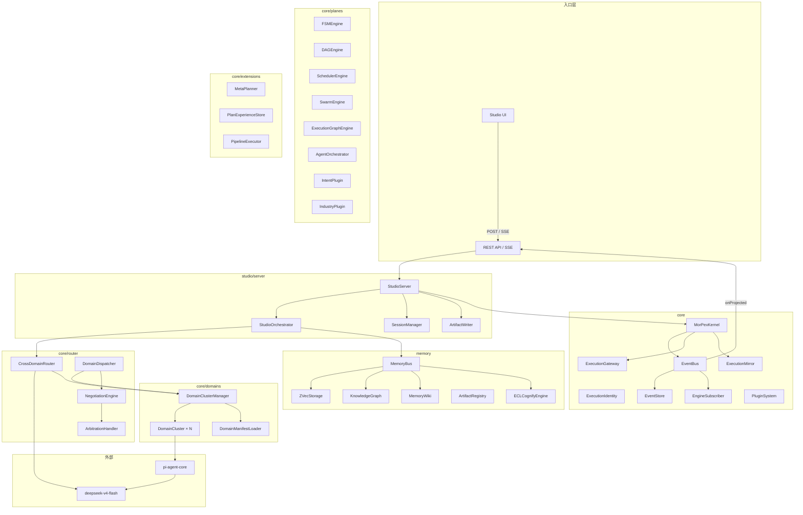
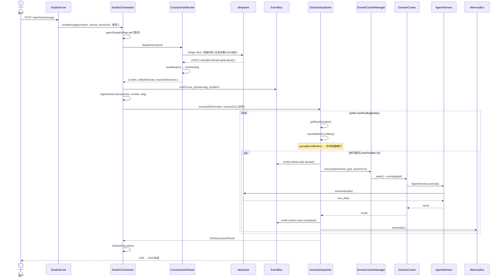
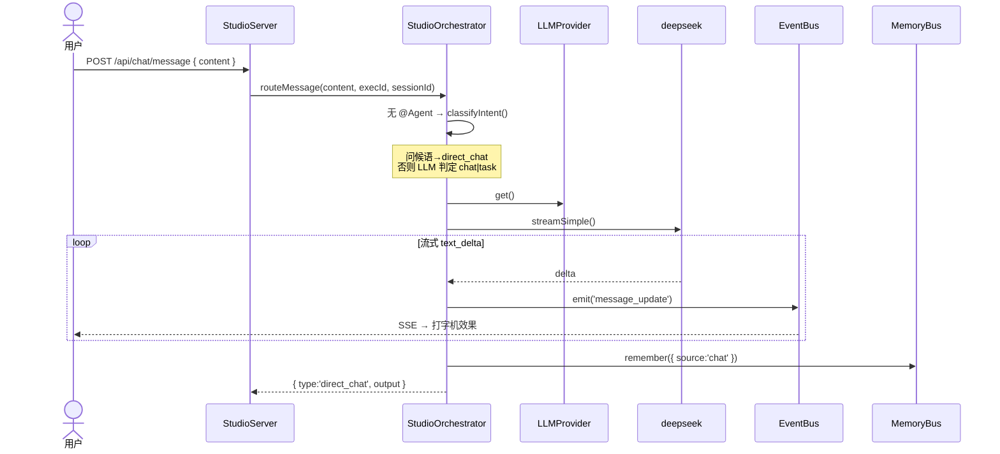
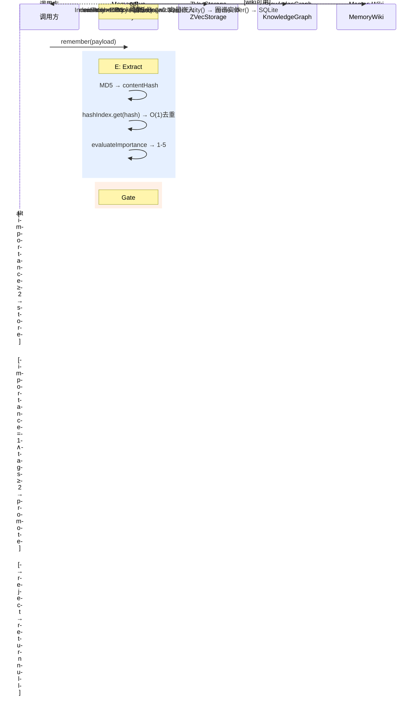
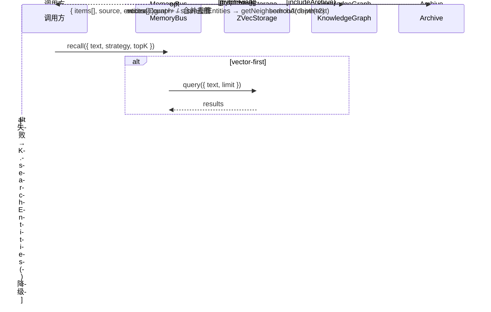
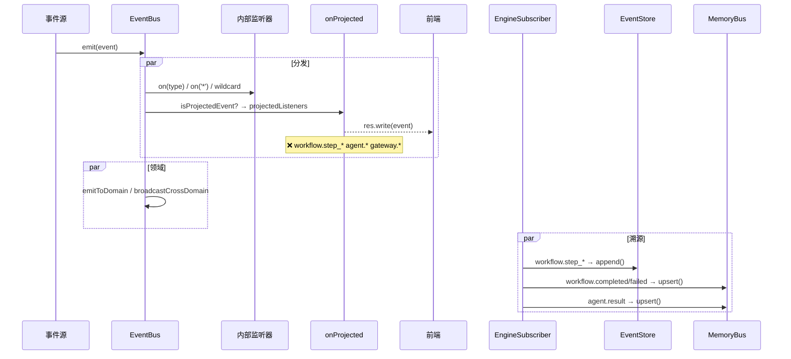
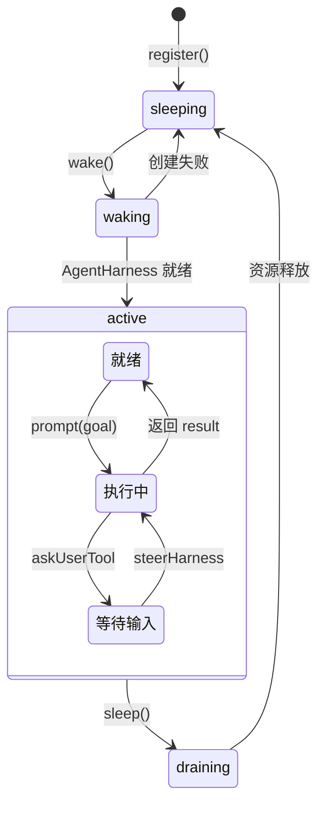
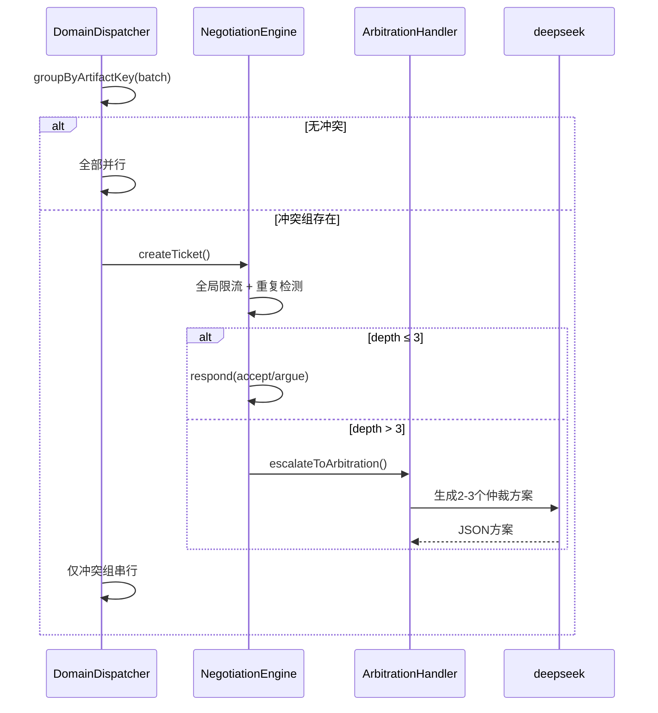
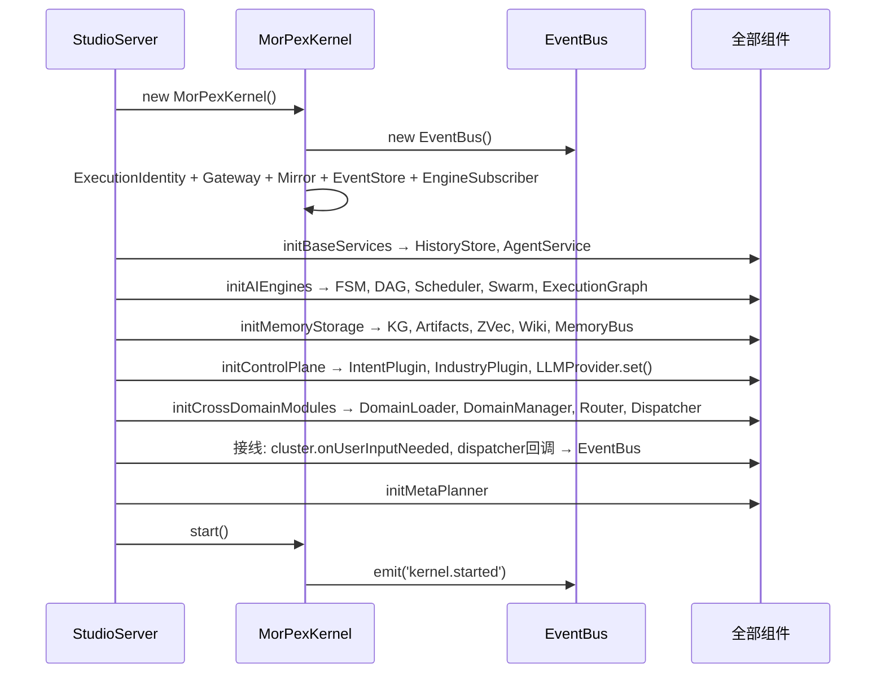

# MORPEX 后端数据流全链路

## 1. 系统组件总览



## 2. 主执行链路: 用户任务 → DAG → 领域执行



## 3. 直接对话链路



## 4. 记忆写入链路 (ECL 流水线)



## 5. 记忆召回链路



## 6. 事件传播链路



## 7. 领域生命周期



## 8. 跨领域协商



## 9. 启动流程



## 10. 数据持久化全景

```mermaid
graph TB
    subgraph 文件系统
        direction LR
        F1[index.jsonl]
        F2[archive.jsonl]
        F3[gate-log.jsonl]
        F4[compaction-log.jsonl]
        F5[chat-history/{sid}.jsonl]
        F6[task-history/{eid}/{tid}.jsonl]
        F7[session-names.json]
        F8[workspace/projects/{eid}/]
        F9[domains/*.json]
        F10[plan-experience/]
        F11[mirror/]
    end

    subgraph 向量
        V1[data/zvec/]
    end

    subgraph SQLite
        S1[data/wiki/]
    end

    MB[MemoryBus] --> F1
    MB --> F2
    MB --> F3
    MB --> F4
    MB --> V1
    MB --> S1

    SM[SessionManager] --> F5
    SM --> F6
    SM --> F7

    AW[ArtifactWriter] --> F8

    DML[DomainManifestLoader] --> F9

    MP[MetaPlanner] --> F10

    EM[ExecutionMirror] --> F11
```

## 数据流速查表

| 链路 | 入口 | 核心调用链 | 出口 |
|------|------|-----------|------|
| 任务执行 | `POST /api/chat/message` | `SO→CDR.dispatch→LLM→DD.executeDAG→DCM.execute→DC→PI.prompt→LLM` | SSE + JSONL |
| 直接对话 | `POST /api/chat/message` | `SO.routeMessage→classifyIntent→LLM.streamSimple` | SSE + JSONL |
| 记忆检索 | `POST /api/chat/message` | `SO→MB.recall→ZV.query+K.searchEntities` | HTTP JSON |
| 记忆写入 | 任意组件 | `MB.remember→ECL→index.jsonl+ZVec+KG` | JSONL |
| 记忆压缩 | 定时/显式 | `MB.compactMemories→类型遗忘+Pool淘汰+score重算` | JSONL |
| 事件传播 | 任意组件 | `EB.emit→on+onProjected+EngineSubscriber` | SSE + EventStore |
| 领域唤醒 | `DCM.execute` | `DC.wake→loadSkills→new AgentHarness` | 内存 |
| 协商仲裁 | `DD.resolveBatchConflicts` | `NE.createTicket→respond→AH.escalate` | 内存 |
| 任务恢复 | `POST /api/task/resume` | `DD.executeNode→历史上下文注入→DC.execute` | SSE |
| 执行查询 | `GET /api/execution/:id` | `SO.getExecution→executionStore.get` | HTTP JSON |
