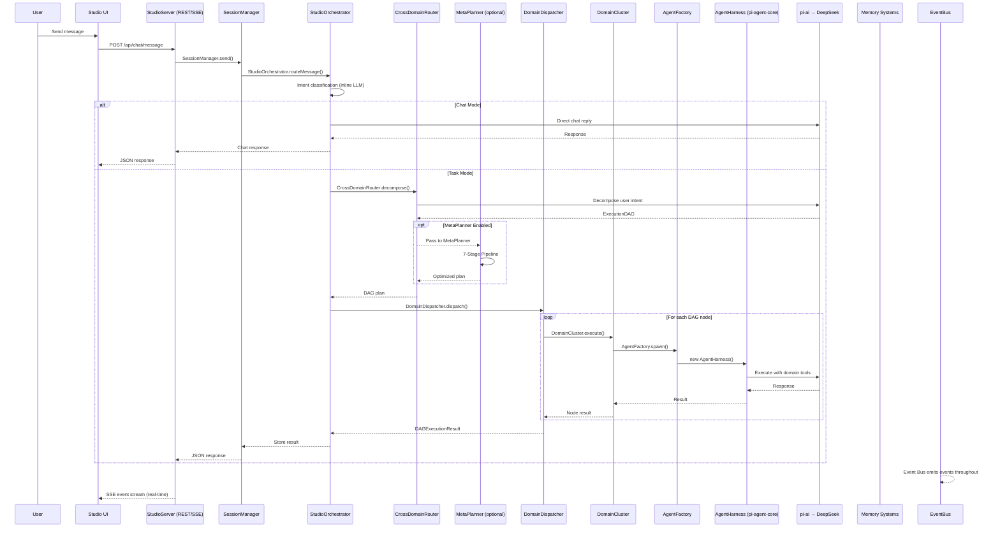
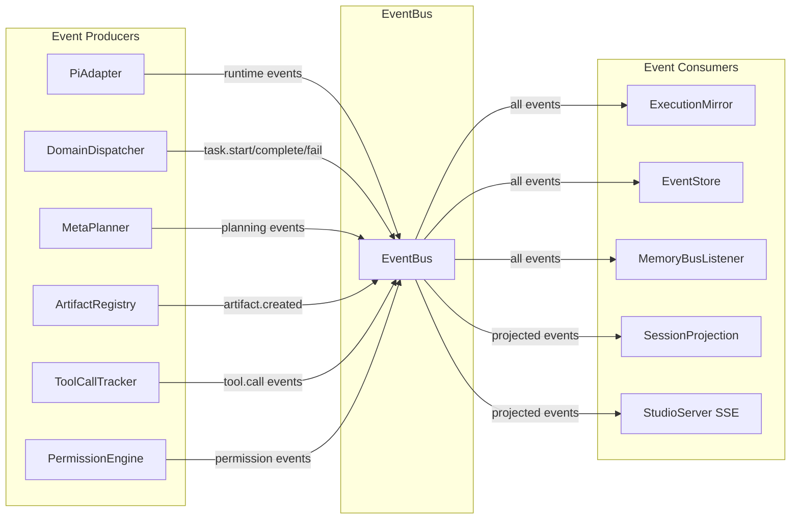
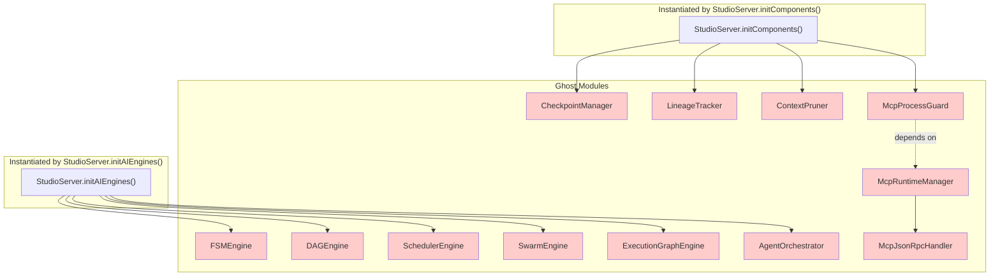

# 06 — Mermaid Dependency Diagram

> **Phase 4**: Visual dependency graph in Mermaid format
> **Date**: 2026-07-18

---

## Diagram 1: Package-Level Dependencies

```mermaid
graph TD
    subgraph "User Facing"
        UI["packages/studio/ui<br/>(React + Three.js)"]
    end

    subgraph "Server"
        SS["packages/studio/server<br/>(StudioServer)"]
        SM["SessionManager"]
        SO["StudioOrchestrator"]
        SS --> SM
        SS --> SO
    end

    subgraph "Core Engine"
        K["MorPexKernel"]
        EB["EventBus"]
        PS["PluginSystem"]
        EG["ExecutionGateway"]
        CG["ContractGateway"]
        PA["PiAdapter"]
        MIR["ExecutionMirror"]
        ES["EventStore"]
    end

    subgraph "Planning"
        MP["MetaPlanner"]
        PE["PipelineExecutor"]
        ST1["Stage 1:"]
        ST2["Stage 2:"]
        ST3["Stage 3:"]
        ST4["Stage 4:"]
        ST5["Stage 5:"]
        ST6["Stage 6:"]
        ST7["Stage 7:"]
        PES["PlanExperienceStore"]
        PE --> ST1
        PE --> ST2
        PE --> ST3
        PE --> ST4
        PE --> ST5
        PE --> ST6
        PE --> ST7
        MP --> PE
        MP --> PES
    end

    subgraph "Routing"
        CR["CrossDomainRouter"]
        DD["DomainDispatcher"]
        NE["NegotiationEngine"]
        AH["ArbitrationHandler"]
    end

    subgraph "Domains"
        DCM["DomainClusterManager"]
        DC["DomainCluster"]
        AF["AgentFactory"]
        DCM --> DC
        DC --> AF
    end

    subgraph "Memory & Knowledge"
        MB["MemoryBus"]
        MW["MemoryWiki"]
        KG["KnowledgeGraph"]
        ZV["ZVecStorage"]
        HS["HistoryStore"]
        MR["MemoryRetriever"]
        MB --> ZV
        MW --> ZV
    end

    subgraph "LLM"
        PI_AI["@earendil-works/pi-ai"]
        PI_AC["@earendil-works/pi-agent-core"]
        LLP["LLMProvider"]
    end

    subgraph "Adapters (Disconnected)"
        PIA["PiAIAdapter"]
        PACA["PiAgentCoreAdapter"]
        MRA["MockRuntimeAdapter"]
    end

    subgraph "Contracts"
        CT["@morpex/contracts"]
    end

    subgraph "Ghost Modules"
        FSM["FSMEngine"]
        DAG_E["DAGEngine"]
        SCH["SchedulerEngine"]
        SW["SwarmEngine"]
        EXG["ExecutionGraphEngine"]
        AO["AgentOrchestrator"]
        MCP["McpRuntimeManager"]
        CP["CheckpointManager"]
        LT["LineageTracker"]
        CTP["ContextPruner"]
    end

    %% Dependencies
    UI --> SS
    SS --> K
    SS --> SM
    SS --> SO
    SS --> MB
    SS --> MW
    SS --> HS
    SS --> MR
    SS --> PI_AI
    SS --> PI_AC
    SS --> FSM
    SS --> DAG_E
    SS --> SCH
    SS --> SW
    SS --> EXG
    SS --> AO

    SO --> CR
    SO --> DD

    K --> EB
    K --> PS
    K --> EG
    K --> CG
    K --> PA
    K --> MIR
    K --> ES

    CR --> DCM
    DD --> DCM
    DD --> NE
    DD --> AH

    DC --> AF
    AF --> PI_AC

    MB --> KG
    MW ..->|"reverse dep"| KG

    PA --> PI_AI
    LLP --> PI_AI

    %% Dead connections
    PIA -.->|"never wired"| CG
    PACA -.->|"never wired"| CG

    MCP -.->|"ghost"| CTP

    style PIA fill:#ff9999,stroke:#ff0000
    style PACA fill:#ff9999,stroke:#ff0000
    style MRA fill:#ff9999,stroke:#ff0000
    style FSM fill:#ffcccc,stroke:#ff0000,stroke-dasharray: 5 5
    style DAG_E fill:#ffcccc,stroke:#ff0000,stroke-dasharray: 5 5
    style SCH fill:#ffcccc,stroke:#ff0000,stroke-dasharray: 5 5
    style SW fill:#ffcccc,stroke:#ff0000,stroke-dasharray: 5 5
    style EXG fill:#ffcccc,stroke:#ff0000,stroke-dasharray: 5 5
    style AO fill:#ffcccc,stroke:#ff0000,stroke-dasharray: 5 5
    style MCP fill:#ffcccc,stroke:#ff0000,stroke-dasharray: 5 5
    style CP fill:#ffcccc,stroke:#ff0000,stroke-dasharray: 5 5
    style LT fill:#ffcccc,stroke:#ff0000,stroke-dasharray: 5 5
    style CTP fill:#ffcccc,stroke:#ff0000,stroke-dasharray: 5 5
```

---

## Diagram 2: Runtime Request Flow

---

## Diagram 3: Event Bus Wiring

---

## Diagram 4: Ghost Module Graph (Dead Code)

