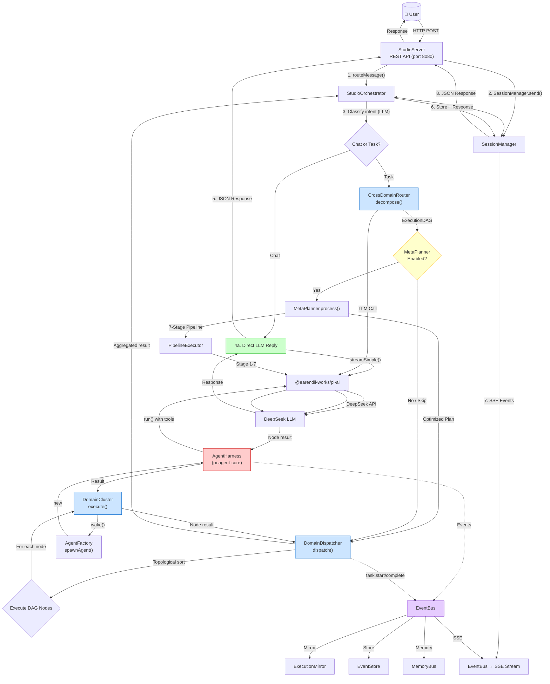
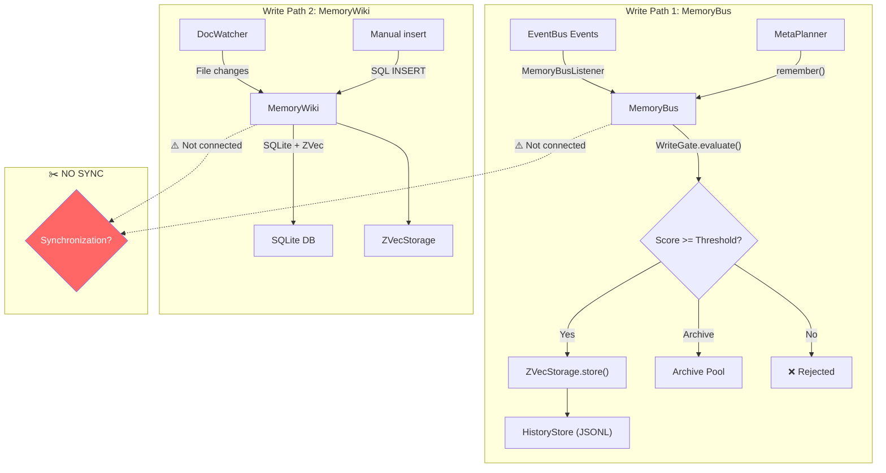
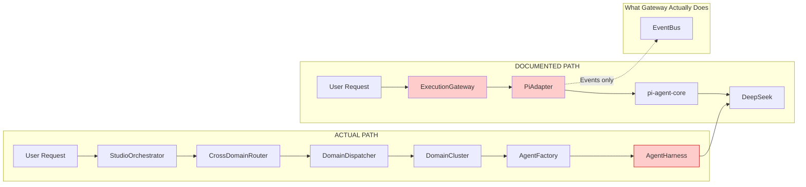
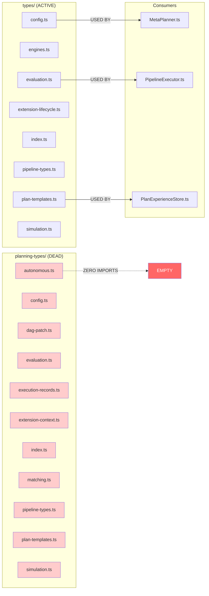

# 08 — Data Flow Mermaid Diagram

> **Phase 5**: Visual data flow diagram
> **Date**: 2026-07-18

---

## Data Flow Diagram 1: End-to-End Request Flow

---

## Data Flow Diagram 2: Memory Write Paths (Broken)

---

## Data Flow Diagram 3: Gateway Bypass

---

## Data Flow Diagram 4: Duplicate Planning Types

