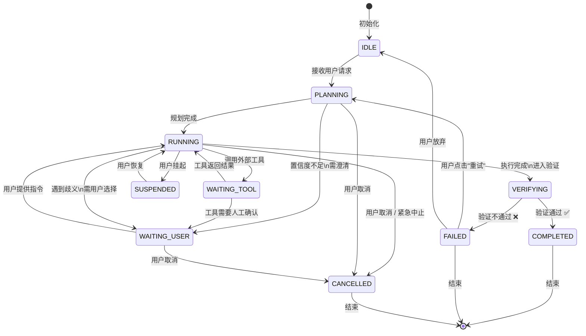
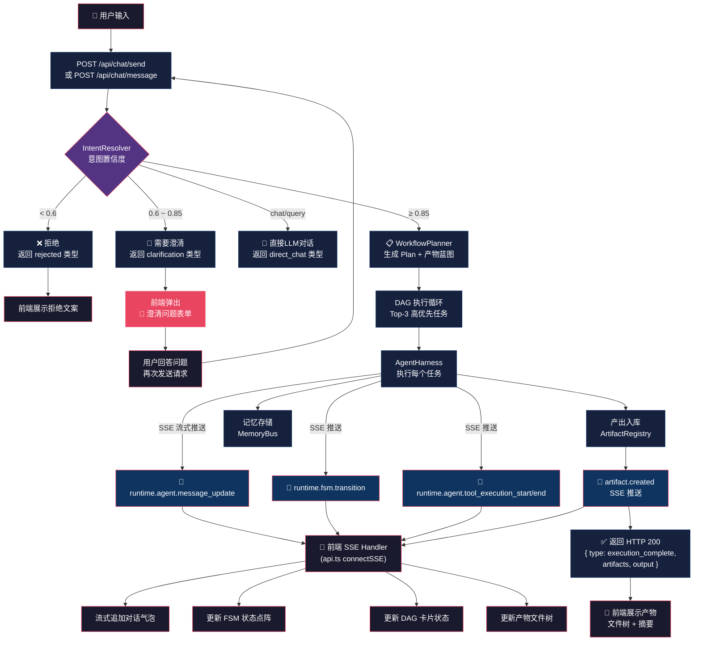
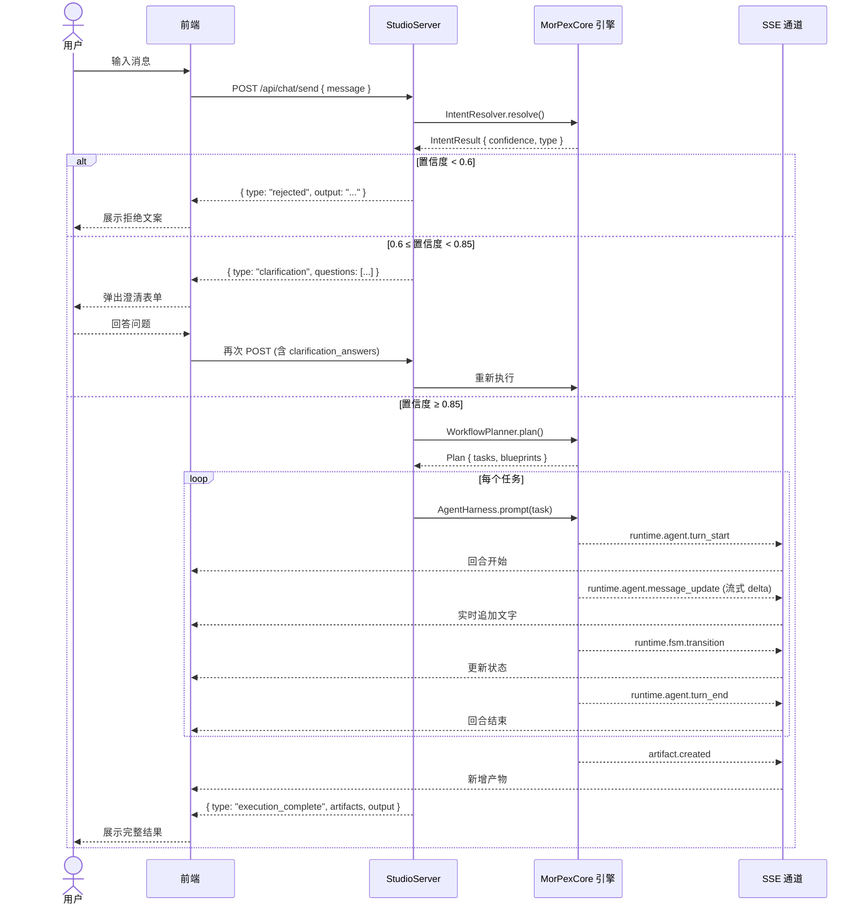
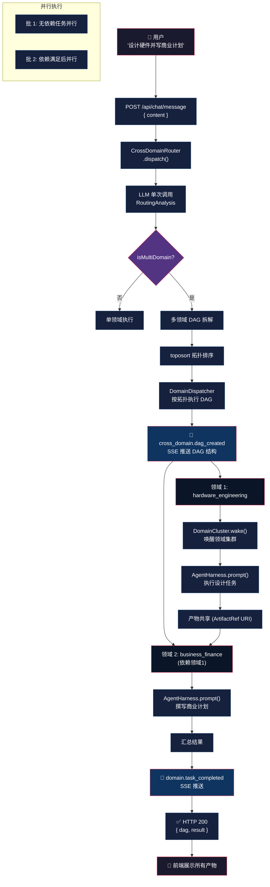
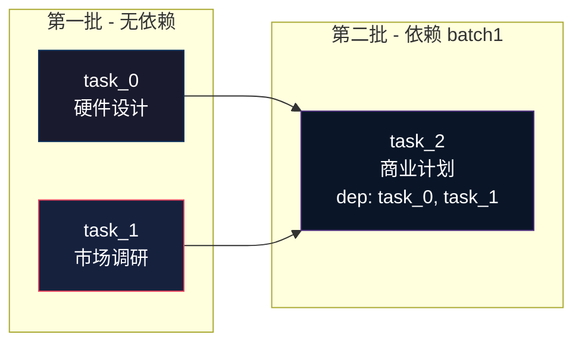
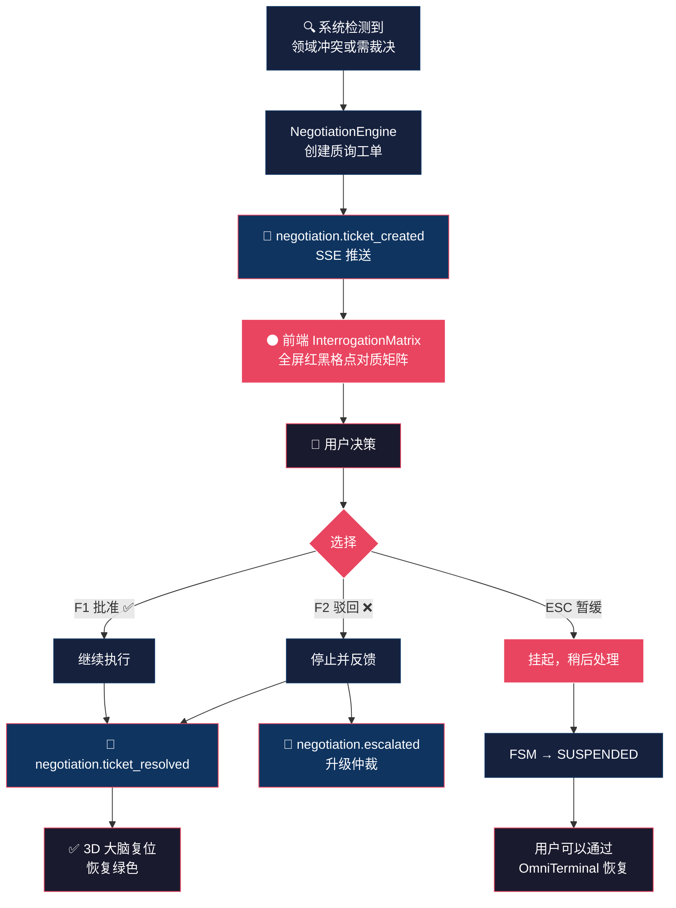
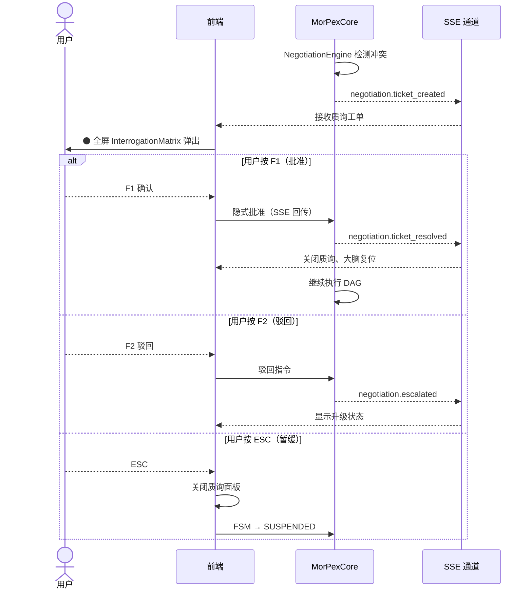
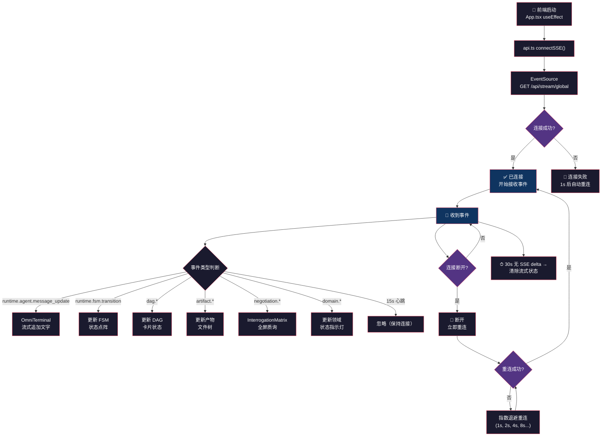
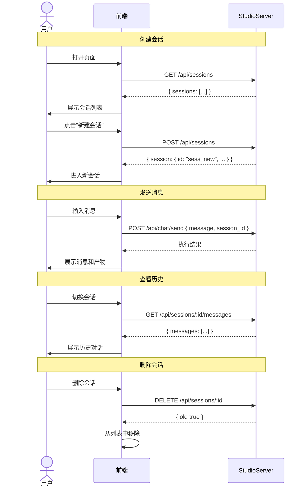

# 02 — 核心业务流程（Business Flow）

> **用途**: 用 Mermaid 画出用户的操作路径，包含状态流转、轮询、SSE 推送、确认弹窗
> **版本**: 3.1.0 | **最后更新**: 2026-07-12
> **提示**: Obsidian 原生支持 Mermaid，可边画边改

---

## 目录

- [一、任务状态机（FSM）](#一任务状态机fsm)
- [二、主对话流程](#二主对话流程)
- [三、跨领域 DAG 流程](#三跨领域-dag-流程)
- [四、澄清对话流程](#四澄清对话流程)
- [五、人机协作 / 质询仲裁流程](#五人机协作--质询仲裁流程)
- [六、SSE 连接生命周期](#六sse-连接生命周期)
- [七、会话管理流程](#七会话管理流程)
- [八、关键交互机制说明](#八关键交互机制说明)

---

## 一、任务状态机（FSM）

> 所有任务执行都遵循此状态流转。前端通过 **SSE `runtime.fsm.transition`** 事件实时更新状态指示器。



### 状态对照表（前端用）

| FSM 状态 | 中文含义 | 前端显示（颜色） | 用户可操作 |
|----------|----------|------------------|-----------|
| `IDLE` | 空闲 | 灰色 ● | — |
| `PLANNING` | 规划中 | 蓝色脉冲 ● | 取消 |
| `RUNNING` | 执行中 | 绿色旋转 ● | 取消、挂起 |
| `WAITING_TOOL` | 等待工具 | 黄色闪烁 ● | — |
| `WAITING_USER` | 等待用户 | 橙色 ● **弹窗提示** | **确认/取消/提供信息** |
| `VERIFYING` | 验证中 | 紫色 ● | — |
| `COMPLETED` | 已完成 | 绿色常亮 ✅ | 查看产物 |
| `FAILED` | 失败 | 红色 ● ❌ | **重试**、放弃 |
| `SUSPENDED` | 已挂起 | 灰色 ● | **恢复**、取消 |
| `CANCELLED` | 已取消 | 灰色删除线 ~~●~~ | — |

---

## 二、主对话流程

> 用户发送消息 → 后端意图解析 → 执行 → SSE 实时推送 → 返回结果



### 序列图版本



---

## 三、跨领域 DAG 流程

> 用户提出跨领域复杂需求 → LLM 拆解为多领域 DAG → 并行/串行分发执行



### 领域并行调度



---

## 四、澄清对话流程

> 当 IntentResolver 置信度在 0.6~0.85 之间时触发

```mermaid
sequenceDiagram
    actor 用户
    participant FE as 前端
    participant API as StudioServer
    participant Engine as MorPexCore

    用户->>FE: 输入 "帮我做一个工具"
    FE->>API: POST /api/chat/send { message }
    API->>Engine: IntentResolver.resolve()
    Engine-->>API: confidence = 0.72 (ambiguous)

    API-->>FE: {
        type: "clarification",
        questions: [
            { id: "q1", question: "用什么语言？", type: "choice", options: ["Node.js", "Python"] },
            { id: "q2", question: "主要功能？", type: "open" }
        ]
    }

    FE-->>用户: 🔴 弹出澄清卡槽 (ClarifySlots)

    Note over 用户,FE: 用户回答

    用户-->>FE: 选择 "Node.js"，输入 "文件管理"
    FE->>API: POST /api/chat/send {
        message: "Node.js，文件管理",
        clarification_answers: { q1: "Node.js", q2: "文件管理" }
    }
    API->>Engine: 重新执行（置信度上升至 ≥ 0.85）
    Engine-->>API: 执行完成
    API-->>FE: { type: "execution_complete", ... }
    FE-->>用户: 展示结果
```

### 前端澄清弹窗逻辑

| 场景 | 弹窗类型 | 用户操作 |
|------|----------|----------|
| 置信度 0.6~0.85 | 🔴 `ClarifySlots` 卡槽 | 选择/输入答案，按 YES_BUF / NO_BUF |
| 等待用户输入 | 🟠 FSM `WAITING_USER` | 在 OmniTerminal 中输入指令 |
| 工具调用需确认 | 🟡 确认/取消弹窗 | 确认执行或取消 |
| 跨领域冲突 | ⚫ `InterrogationMatrix` 全屏 | 按 F1 批准 / F2 驳回 |

---

## 五、人机协作 / 质询仲裁流程

> 当 NegotiationEngine 检测到跨领域冲突或需要人工裁决时触发



### 质询仲裁序列



---

## 六、SSE 连接生命周期

> 这是前端感知后端状态变化的**唯一实时通道**。没有轮询。



### SSE 事件 → 前端组件映射

| SSE 事件 | → 更新哪个组件 | 更新方式 |
|----------|---------------|----------|
| `runtime.agent.message_update` | OmniTerminal (Xterm.js) | 直写 Canvas，零 React 重渲染 |
| `runtime.fsm.transition` | RightPane - FSM 状态点阵 | Zustand subscribe → ref 更新 |
| `dag.created` / `dag.node.completed` | RightPane - DAG 卡片 | 更新 unifiedStore.flows |
| `artifact.created` / `artifact.updated` | BottomPane - 产物文件树 | 更新 unifiedStore.artifacts |
| `cross_domain.dag_created` | CenterPane - DAG 覆盖层 | 更新 DAG 可视化 |
| `negotiation.ticket_created` | InterrogationMatrix | 全屏覆盖 |
| `domain.waking` / `domain.active` / `domain.sleeping` | LeftPane - 领域列表 | 更新状态指示器 |
| `runtime.execution.*` | TopBar - 执行计数 | 瞬态更新 |

---

## 七、会话管理流程



---

## 八、关键交互机制说明

### 1. 轮询 — ❌ 不需要

> MorPex **没有轮询**。所有状态变化通过 SSE 实时推送。前端不需要任何 `setInterval` 轮询。

| 如果前端想... | 不要这样做 | 应该这样做 |
|---------------|-----------|-----------|
| 获取 FSM 状态 | ❌ 每 1s GET /api/status | ✅ 监听 `runtime.fsm.transition` SSE 事件 |
| 获取执行进度 | ❌ 每 3s GET /api/history | ✅ 监听 `runtime.*` SSE 事件 |
| 获取产物更新 | ❌ 每 5s GET /api/artifacts | ✅ 监听 `artifact.created` SSE 事件 |
| 获取 DAG 更新 | ❌ 轮询 | ✅ 监听 `dag.*` SSE 事件 |

### 2. SSE 推送 — ✅ 唯一实时通道

| 推送类型 | 时机 | 频率 |
|----------|------|------|
| 流式文字 | Agent 生成过程中 | 实时，每次 token |
| 状态变更 | FSM / DAG / Domain 状态变化时 | 事件驱动 |
| 心跳 | 保持连接 | 每 **15s** |
| 质询通知 | 需要人工裁决时 | 事件驱动 |

### 3. 确认/取消弹窗 — 🔴 需要

| 触发条件 | 弹窗类型 | 快捷键 |
|----------|----------|--------|
| 意图置信度 0.6~0.85 | 🔴 澄清卡槽 `ClarifySlots` | YES_BUF / NO_BUF |
| FSM 进入 `WAITING_USER` | 🟠 等待输入指示 | 在终端输入 |
| 跨领域冲突 | ⚫ `InterrogationMatrix` 全屏 | **F1** 批准 / **F2** 驳回 / **ESC** 暂缓 |
| 质询升级 | 🔴 人工仲裁通知 | 同 InterrogationMatrix |

### 4. 前端 SSE 空闲检测

| 机制 | 阈值 | 行为 |
|------|------|------|
| SSE 空闲检测 | **30s** 无任何 SSE 事件 | 清除流式状态，显示"连接超时"提示 |
| SSE 连接断开 | 网络波动 | 自动重连（指数退避: 1s, 2s, 4s, 8s...） |
| 请求级安全网 | **600s** | 后端 Promise.race，返回 504 |
| 紧急中止 | 用户手动触发 | `POST /api/ai/abort` + `Shift+Space` 快捷键 |

### 5. 前端状态更新路径

```
SSE 事件到达
  │
  ▼
api.ts connectSSE() 分发
  │
  ├──→ Zustand unifiedStore (低频状态)
  │      └──→ React 组件重渲染 (flows, agents, domains)
  │
  ├──→ Zustand telemetryStore (高频遥测)
  │      └──→ .subscribe() + useRef DOM 直接更新 (背压、FSM点阵)
  │
  ├──→ Xterm.js OmniTerminal (流式文字)
  │      └──→ Canvas 直写，零 React 重渲染
  │
  └──→ InterrogationMatrix (弹窗)
         └──→ 全屏覆盖层显示/隐藏
```
